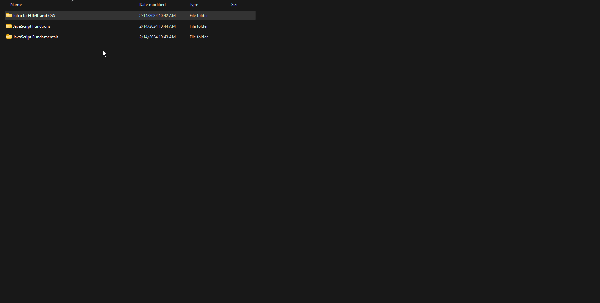
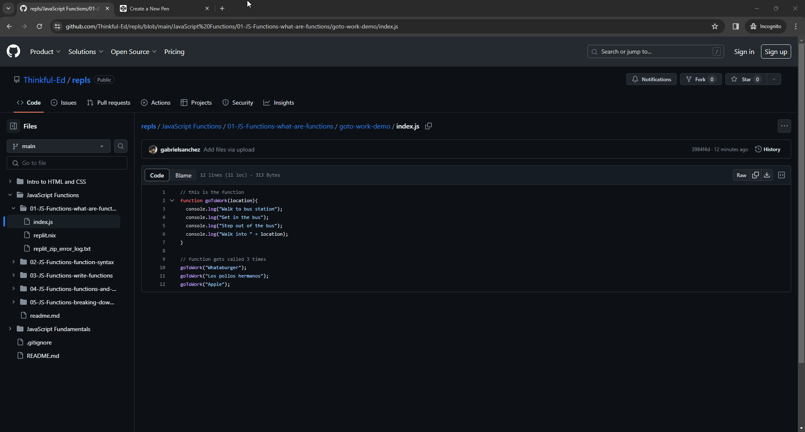

# REPLs

This repository contains the REPL code examples for the Software Engineering (SE) program.

Occasionally, you might encounter situations where the REPLs in the lessons are unavailable. This could be due to an outage, maintenance on Replit's end, or limitations like the 600-minute time cap for usage. If you reach the time limit or can't access the REPLs, there are alternatives: you can download the files to work on the exercises locally on your computer, or you can opt for an alternative online editor, such as Codepen.

Note: The "Welcome to Web Development" module exercises are inside the "Intro to HTML and CSS" folder.

## Running Locally

1. Click [here](https://chegg.sharepoint.com/:u:/s/ImmersionWorkshopDecks/EUdTBfxF4cxCuDODFvuNDOYBElYcFIJPkaPYNRud-wWN1A?e=zSlEMz) to download the zip file containing the REPL challenges in this repository.
2. Unzip `repl.zip`.
3. Locate the specific file you wish to work on within the extracted folder.
4. Open this file with a text editor of your choice (such as Notepad, Notepad++, Visual Studio Code, TextEdit, etc.).
> Note: Although you will learn to use Visual Studio Code later in the course, for now, any text editor is suitable.
6. Modify the code as necessary to complete the exercise.

## Using Codepen

For those interested in using Codepen, please follow the steps below:

1. Navigate to [https://codepen.io/pen](https://codepen.io/pen).
2. Copy and paste the code you wish to work on into the editor. The exercises are located in their corresponding module and lesson folder in this Github repository.
3. If you're working with JavaScript files, simply open the "Console" tab to view outputs and debug.

> Note: If you are working on an exercise with multiple HTML files you may prefer to run the exercise locally.
